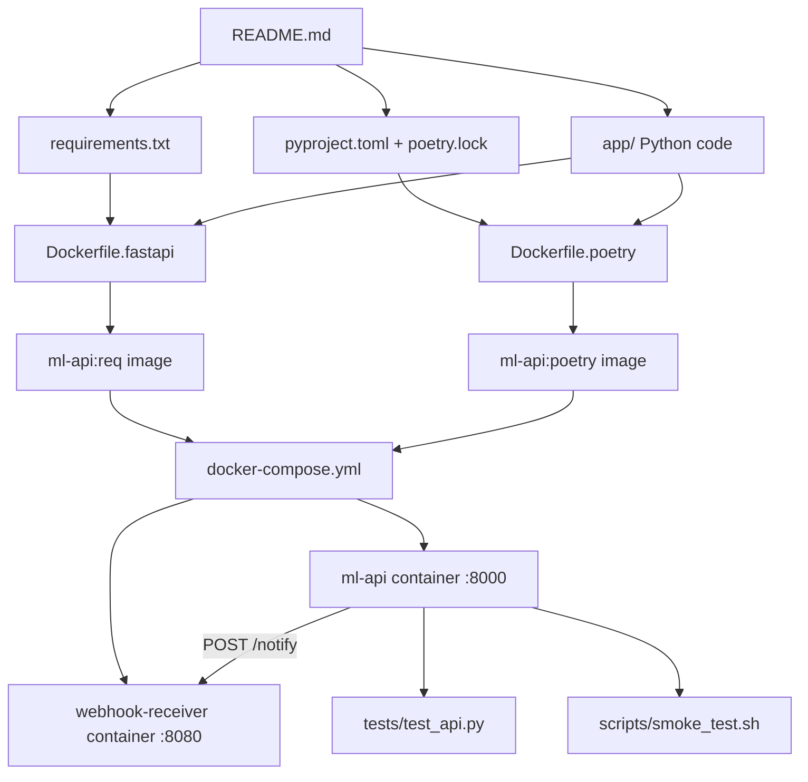

> **Authorship note:** This document was generated with AI assistance under
> human intervention and monitoring, and was edited manually by
> **Mehdi Zadeh** (<mehdi.habibzadehmotlagh@mcgill.ca>).

# MLOps Complete Teaching Guide

A single-file, self-contained guide to learning and teaching MLOps.
Everything you need — Python code, Docker configs, Compose file, tests,
and scripts — is embedded in this document.

**How to use this guide:**
1. Read it top to bottom once.
2. Recreate each file by copying the code blocks into the exact paths shown.
3. Run the commands step by step.
4. By the end, you have a fully working MLOps demo project.

---

## 🔗 How These Files Connect

Below is a map of every file in this project and how they depend on each other.
Use it as a quick reference while building.

```
                         ┌─────────────────────────────────────┐
                         │  README.md (this file)              │
                         │  - overview, instructions, teaching │
                         └─────────────────┬───────────────────┘
                                           │
           ┌───────────────────────────────┼───────────────────────────────┐
           │                               │                               │
           ▼                               ▼                               ▼
   ┌───────────────┐              ┌───────────────┐              ┌───────────────┐
   │ requirements. │              │ pyproject.toml│              │ app/          │
   │ txt           │              │ + poetry.lock │              │ Python code   │
   │ (pip deps)    │              │ (Poetry deps) │              │               │
   └───────┬───────┘              └───────┬───────┘              └───────┬───────┘
           │                              │                              │
           │         ┌────────────────────┘                              │
           │         │                                                   │
           ▼         ▼                                                   ▼
   ┌─────────────────────────┐      ┌─────────────────────────┐
   │ Dockerfile.fastapi      │      │ Dockerfile.poetry       │      ┌──────────────┐
   │ (builds ml-api image)   │      │ (builds ml-api image)   │      │ tests/       │
   └───────────┬─────────────┘      └───────────┬─────────────┘      │ validate API │
               │                                │                    └──────────────┘
               └────────────────┬───────────────┘
                                │
                                ▼
                    ┌───────────────────────┐
                    │ docker-compose.yml    │
                    │ - ml-api service      │
                    │ - webhook-receiver    │
                    └───────────┬───────────┘
                                │
              ┌─────────────────┴─────────────────┐
              │                                   │
              ▼                                   ▼
      ┌───────────────┐                 ┌─────────────────┐
      │ ml-api        │──POST /predict──▶│ webhook-receiver│
      │ :8000         │──WEBHOOK_URL────▶│ :8080/notify    │
      └───────────────┘                 └─────────────────┘
              │
              ▼
      ┌───────────────┐
      │ scripts/      │
      │ smoke_test.sh │
      └───────────────┘
```

**Key dependency lines:**

- `app/` imports `requirements.txt`/`pyproject.toml` packages at runtime.
- `Dockerfile.fastapi` copies `requirements.txt` and `app/`.
- `Dockerfile.poetry` copies `pyproject.toml` + `poetry.lock`, exports a
  `requirements.txt`, then copies `app/`.
- `docker-compose.yml` chooses which Dockerfile to build and wires the
  `WEBHOOK_URL` environment variable to the receiver service.
- `tests/` imports `app.main` directly and does **not** need Docker.
- `scripts/smoke_test.sh` assumes Docker Compose is already running.

---

### Detailed file dependency diagram

This version shows **each file as a box** and **each dependency as a
labeled arrow**.

```
┌─────────────────────────────────────────────────────────────────────────────┐
│                              SOURCE FILES                                     │
│  (these are the files you edit by hand)                                       │
└─────────────────────────────────────────────────────────────────────────────┘
         │                    │                    │
         │ contains deps      │ contains deps      │ imports packages
         │ (pip pins)         │ (Poetry pins)      │ at runtime
         ▼                    ▼                    ▼
┌─────────────────┐  ┌──────────────────────────┐  ┌─────────────────────────┐
│ requirements.txt│  │ pyproject.toml           │  │ app/                    │
│                 │  │ poetry.lock              │  │  ├─ __init__.py         │
│                 │  │                          │  │  ├─ config.py           │
│                 │  │                          │  │  ├─ model.py            │
│                 │  │                          │  │  ├─ schemas.py          │
│                 │  │                          │  │  ├─ webhook.py          │
│                 │  │                          │  │  └─ main.py             │
└────────┬────────┘  └─────────────┬────────────┘  └───────────┬─────────────┘
         │                         │                           │
         │ copied by               │ copied by                 │ copied by
         │ Dockerfile.fastapi      │ Dockerfile.poetry         │ both Dockerfiles
         ▼                         ▼                           ▼
┌─────────────────────────────────────────────────────────────────────────────┐
│                         DOCKER BUILD ARTIFACTS                                │
└─────────────────────────────────────────────────────────────────────────────┘
         │
         │ builds
         ▼
┌─────────────────┐      ┌─────────────────┐
│ ml-api:req      │      │ ml-api:poetry   │
│ (pip image)     │      │ (Poetry image)  │
└────────┬────────┘      └────────┬────────┘
         │                        │
         │ referenced by          │ referenced by
         │ docker-compose.yml     │ docker-compose.yml
         ▼                        ▼
┌─────────────────────────────────────────────────────────────────────────────┐
│                         RUNTIME (Docker Compose)                              │
└─────────────────────────────────────────────────────────────────────────────┘
         │
         │ defines services, ports, env vars
         ▼
┌─────────────────┐      WEBHOOK_URL=http://webhook-receiver:8080/notify
│ docker-compose  │─────────────────────────────────────────────┐
│ .yml            │                                             │
└────────┬────────┘                                             │
         │                                                      │
         │ starts                                               │ sends POST
         ▼                                                      ▼
┌─────────────────┐                                  ┌─────────────────┐
│ ml-api          │                                  │ webhook-receiver│
│ port 8000:8000  │                                  │ port 8080:80    │
└─────────────────┘                                  └─────────────────┘
         │
         │ tested by
         ▼
┌─────────────────┐      ┌─────────────────┐
│ tests/          │      │ scripts/        │
│ test_api.py     │      │ smoke_test.sh   │
│ (no Docker)     │      │ (needs Compose) │
└─────────────────┘      └─────────────────┘
```

### Dependency table

| File | Depends on | Why |
| ---- | ---------- | --- |
| `app/*.py` | `requirements.txt` or `pyproject.toml` | Imports FastAPI, scikit-learn, requests, etc. |
| `Dockerfile.fastapi` | `requirements.txt`, `app/` | Copies both into the image |
| `Dockerfile.poetry` | `pyproject.toml`, `poetry.lock`, `app/` | Exports lock file to requirements, then copies app |
| `docker-compose.yml` | `Dockerfile.fastapi` (or `.poetry`) | Tells Compose which image to build |
| `docker-compose.yml` | `app/` (indirectly) | Rebuilds when source changes because build context includes it |
| `tests/test_api.py` | `app/main.py` | Imports the FastAPI app directly |
| `scripts/smoke_test.sh` | Running Compose stack | Sends HTTP requests to `localhost:8000` and `localhost:8080` |
| `scripts/webhook_receiver.py` | Flask | Optional local receiver instead of httpbin |

### Mermaid version (for viewers that support it)



---

## 📚 Table of Contents

- [How These Files Connect](#-how-these-files-connect)
- [Docker Concepts Explained](#docker-concepts-explained)
1. [Overview & Learning Objectives](#1-overview--learning-objectives)
2. [Prerequisites](#2-prerequisites)
  - [Installing Git on Windows](#installing-git-on-windows)
    - [Installing Node.js and npm on Windows](#installing-nodejs-and-npm-on-windows)
    - [Adding the CrewAI skill in VS Code](#adding-the-crewai-skill-in-vs-code)
   - [Installing Docker Desktop on Windows](#installing-docker-desktop-on-windows)
3. [Final Project Structure](#3-final-project-structure)
   - [3.1 — What all these files do together](#31--what-all-these-files-do-together)
4. [Setup: Create the Project Skeleton](#4-setup-create-the-project-skeleton)
5. [The Python Application Code](#5-the-python-application-code)
   - [5.1 — `app/__init__.py`](#51--app__init__py)
   - [5.2 — `app/config.py`](#52--appconfigpy)
   - [5.3 — `app/model.py`](#53--appmodelpy)
   - [5.4 — `app/schemas.py`](#54--appschemaspy)
   - [5.5 — `app/webhook.py`](#55--appwebhookpy)
   - [5.6 — `app/main.py`](#56--appmainpy)
   - [5.7 — Webhook Deep Dive](#57--webhook-deep-dive)
6. [Tests](#6-tests)
   - [6.1 — `tests/__init__.py`](#61--tests__init__py)
   - [6.2 — `tests/test_api.py`](#62--teststest_apipy)
   - [6.3 — Smoke test vs. unit test](#63--smoke-test-vs-unit-test)
7. [Dependency Files](#7-dependency-files)
8. [Dockerfiles](#8-dockerfiles)
9. [Docker Compose](#9-docker-compose)
10. [Utility Scripts](#10-utility-scripts)
11. [Ignore Files](#11-ignore-files)
12. [How to Run Everything](#12-how-to-run-everything)
  - [Configure Git and publish a feature branch](#12-6-configure-git-and-publish-a-feature-branch)
13. [Classroom Teaching Flow](#13-classroom-teaching-flow)
14. [Exercises](#14-exercises)
15. [Troubleshooting](#15-troubleshooting)
16. [Key Concepts Cheat Sheet](#16-key-concepts-cheat-sheet)

---

## Docker Concepts Explained

If you are new to Docker, read this section before continuing. It explains
the core ideas used throughout this guide: Docker, images, containers, the
Docker daemon, and Docker Compose.

### What is Docker?

**Docker** is a platform that packages software into standardized units called
**containers**. A container includes everything an application needs to run:
code, runtime, system tools, libraries, and settings.

Think of it like a shipping container. Before shipping containers existed,
cargo had to be loaded and unloaded in many different ways depending on the
vehicle. Shipping containers standardized that process. Docker does the same
for software: it packages your application so it runs the same way on your
laptop, on a test server, and in production.

### What is a container?

A **container** is a running instance of an image. It is an isolated process
on your computer that has its own filesystem, network interfaces, and process
space — but it shares the host machine's kernel.

Key properties:

- **Isolated:** Processes inside a container cannot see or interfere with
  processes outside it (and vice versa) unless explicitly allowed.
- **Lightweight:** Containers share the host OS kernel, so they start in
  seconds and use less memory than virtual machines.
- **Portable:** A container built on your laptop will run the same way on any
  machine with Docker installed.
- **Ephemeral:** You can stop, start, and delete containers easily. Data that
  must survive container restarts should be stored in volumes.

Analogy:

| Concept | Real-world analogy |
| ------- | ------------------ |
| Image | A recipe + ingredients for a meal |
| Container | The actual cooked meal on a plate |
| Dockerfile | The recipe written down |
| Docker Hub | A grocery store where you download ingredients |

### Image vs. container

- An **image** is a read-only template. It contains the application code,
  dependencies, and instructions for how to run.
- A **container** is a runnable instance of an image. You can have many
  containers running from the same image.

```bash
# Build an IMAGE from a Dockerfile
docker build -t ml-api:req .

# Run a CONTAINER from that image
docker run -p 8000:8000 ml-api:req

# List running containers
docker ps

# List all images
docker images
```

### What is the Docker daemon?

The **Docker daemon** (`dockerd`) is a background service that runs on your
machine and manages Docker objects: images, containers, networks, and volumes.

When you type a command like `docker run`, the Docker **client** (`docker`)
sends the request to the daemon. The daemon does the actual work: pulling
images, creating containers, allocating networks, and so on.

```text
You (terminal)
    │
    │ docker run hello-world
    ▼
Docker client (docker CLI)
    │
    │ REST API call
    ▼
Docker daemon (dockerd)
    │
    │ creates / manages
    ▼
Container
```

On Windows with Docker Desktop, the daemon runs inside a lightweight Linux
VM managed by WSL 2. You usually do not interact with it directly, but you
know it is working when commands like `docker ps` succeed.

### What is Docker Compose?

**Docker Compose** is a tool for defining and running multi-container
applications. Instead of starting each container with a long `docker run`
command, you describe your whole stack in a `docker-compose.yml` file and
start everything with one command:

```bash
docker compose up
```

Compose handles:

- Building images
- Starting multiple containers in the right order
- Creating a private network so containers can talk to each other by name
- Mounting volumes
- Setting environment variables
- Mapping ports

In this project, `docker-compose.yml` defines two services:

1. `ml-api` — the FastAPI model service
2. `webhook-receiver` — a service that receives webhook notifications

Without Compose, you would have to run two separate `docker run` commands,
manually create a network, and pass environment variables yourself. Compose
makes this repeatable and version-controlled.

### Why do we need all of this for MLOps?

Machine learning systems have many moving parts: models, APIs, data pipelines,
monitoring, and more. Docker and Compose help MLOps teams:

- **Reproduce environments:** A model that trains on one laptop trains the
  same way on another.
- **Deploy consistently:** The same image runs in development, staging, and
  production.
- **Scale services:** Compose is a stepping stone to Kubernetes, where dozens
  or hundreds of containers run together.
- **Isolate dependencies:** Different models can use different Python or
  library versions without conflicts.

---

## 1. Overview & Learning Objectives

### What this project teaches

This is a complete, hands-on MLOps walkthrough. Students start with a tiny
ML model and end with:

- A containerized FastAPI model service
- Two Docker build strategies (pip and Poetry)
- A multi-service orchestration with Docker Compose
- An event-driven **Webhook** notification flow
- Automated tests and smoke scripts

The model is deliberately trivial (linear regression on 5 data points for
"house price prediction"). This keeps the focus on the **MLOps tooling**,
not on ML theory.

### Learning objectives

After completing this tutorial, students will be able to:

1. Wrap an ML model in a REST API using FastAPI
2. Write a production-quality Dockerfile for a Python ML service
3. Explain the difference between `requirements.txt` and Poetry
4. Describe what a multi-stage Docker build is and why it produces
   smaller, safer images
5. Orchestrate two services with Docker Compose and explain the Compose
   DNS model
6. Trigger a Webhook from inside a running container and verify delivery
7. Write tests for an ML API and run them in CI-friendly environments

### The MLOps flow you will build

```
  ┌────────────┐   ┌────────────┐   ┌──────────────┐   ┌──────────┐
  │ ML Model   │ → │ FastAPI    │ → │ Docker Image │ → │ Compose  │
  │ (sklearn)  │   │ Service    │   │ (pip/Poetry) │   │ Stack    │
  └────────────┘   └────────────┘   └──────────────┘   └──────────┘
                                                              │
                                                              ▼
                                                       ┌──────────────┐
                                                       │  Webhook     │
                                                       │  Receiver    │
                                                       └──────────────┘
```

---

## 2. Prerequisites

| Tool            | Minimum Version | Purpose                          |
| --------------- | --------------- | -------------------------------- |
| Python          | 3.11            | Local development runtime        |
| Docker Engine   | 24.0            | Building and running containers  |
| Docker Compose  | v2              | Multi-service orchestration      |
| `curl`          | recent          | Smoke testing the API            |
| `git`           | recent          | Version control (optional)       |

Optional:
- `poetry` (`pip install poetry`) for local development without Docker

### Installing Git on Windows

1. Download and install Git for Windows from the official
  [Git download page](https://git-scm.com/install/windows).
2. Open a new PowerShell window and verify the installation:

```powershell
git --version
```

For example, a successful installation may display:

```text
git version 2.40.0.windows.1
```

Configure the name and email Git will record as the author of your commits:

```powershell
git config --global user.name "Mehdi Zadeh"
git config --global user.email "zadeh180mehdi@gmail.com"
```

These are commit identity settings; they do not sign you in to GitHub. Confirm
the configured values with:

```powershell
git config --global user.name
git config --global user.email
```

### Installing uv on Windows

Open PowerShell and install `uv` with the official installer:

```powershell
powershell -ExecutionPolicy ByPass -c "irm https://astral.sh/uv/install.ps1 | iex"
```

Open a new PowerShell window, then verify the installation:

```powershell
uv --version
```

### Installing Node.js and npm on Windows

The CrewAI skill installer uses `npx`, which is included with npm and is
installed with Node.js.

1. Download the current **LTS** release from the official
  [Node.js download page](https://nodejs.org/en/download).
2. Run the Windows installer and keep the option to add Node.js to `PATH`
  enabled.
3. Close and reopen PowerShell, then verify that Node.js, npm, and npx are
  available:

```powershell
node --version
npm --version
npx.cmd --version
```

### Adding the CrewAI skill in VS Code

Run the following commands in PowerShell. The execution-policy setting is
scoped to your Windows user; it is not unrestricted permission. `RemoteSigned`
allows locally created scripts and requires downloaded scripts to be signed.
The `npx.cmd` command below invokes the Windows command shim directly.

```powershell
Set-ExecutionPolicy -Scope CurrentUser -ExecutionPolicy RemoteSigned
npx.cmd skills add crewaiinc/skills
```

If PowerShell asks for confirmation when changing the policy, review the prompt
and confirm only if you intend to apply this setting. The installer may ask
which agents or skill locations to target; choose the VS Code/GitHub Copilot
option if it is offered. After installation, inspect the added skill files,
then reload the VS Code window so the editor can discover them. Treat third-party
skills as executable instructions and review them before use.

### Installing Docker Desktop on Windows

Docker Desktop is the easiest way to get Docker Engine and Docker Compose on
Windows. It also includes the Windows Subsystem for Linux 2 (WSL 2) backend,
which gives you a Linux kernel inside Windows.

**Step 1 — Check system requirements**

- Windows 10 version 19041+ or Windows 11
- 64-bit processor with Second Level Address Translation (SLAT)
- 4 GB RAM minimum (8 GB recommended)
- BIOS-level hardware virtualization enabled (Intel VT-x or AMD-V)

**Step 2 — Enable WSL 2 (Windows 10/11)**

Open PowerShell as Administrator and run:

```powershell
wsl --install
```

This installs WSL 2 and the default Ubuntu distribution. Restart when prompted.

If WSL is already installed, make sure version 2 is the default:

```powershell
wsl --set-default-version 2
```

**Step 3 — Download Docker Desktop**

1. Download Docker Desktop for Windows from: <https://www.docker.com/products/docker-desktop>
2. Run the installer (`.exe` file).
3. During installation, keep **"Use WSL 2 instead of Hyper-V"** checked (recommended).
4. Restart your PC when prompted.
5. Launch **Docker Desktop** from the Start menu and wait for the whale icon in the system tray to stop animating. This indicates Docker is ready.

**Step 4 — Verify the installation**

Open PowerShell or a WSL terminal and run:

```bash
docker --version
docker compose version
```

You should see versions such as:

```text
Docker version 27.x.x, build xxxxxxx
Docker Compose version v2.x.x
```

**Step 5 — Start Docker Desktop**

Open the Start menu and launch **Docker Desktop**. Wait until the whale icon in
the system tray is no longer animated. This means the Docker Engine is running
and the app is ready for use.

**Step 6 — Test with a hello-world container**

```bash
docker run hello-world
```

If you see a welcome message, Docker is ready.

> **Tip for Windows users:** Run all commands in this guide inside a WSL 2
> terminal (Ubuntu) or PowerShell. WSL 2 gives you the same Linux environment
> used by the containers and avoids line-ending issues with shell scripts.

---

## 3. Final Project Structure

You will create this exact tree:

```
mlops-demo/
├── README.md                    ← this file
├── requirements.txt
├── pyproject.toml
├── Dockerfile.fastapi
├── Dockerfile.poetry
├── docker-compose.yml
├── .dockerignore
├── .gitignore
├── app/
│   ├── __init__.py
│   ├── config.py
│   ├── model.py
│   ├── schemas.py
│   ├── webhook.py
│   └── main.py
├── tests/
│   ├── __init__.py
│   └── test_api.py
└── scripts/
    ├── smoke_test.sh
    └── webhook_receiver.py
```

### 3.1 — What all these files do together

Think of this project as a tiny factory that receives a request, makes a
machine-learning prediction, and optionally phones a friend to say "I just
did that." The files are the assembly line, the shipping containers, the
quality-control checks, and the instruction manual. Here is how they fit
together in plain English.

**1. The application code (`app/`) is the factory floor.**

- [`app/main.py`](#56--appmainpy) is the front door. It is a FastAPI
  application that exposes three HTTP endpoints: `/health` ("are you
  alive?"), `/model/info` ("tell me about the model"), and `/predict`
  ("give me a price for this house"). When a client sends a `POST`
  request to `/predict`, FastAPI validates the input, asks the model for
  a prediction, and optionally fires off a webhook notification.
- [`app/model.py`](#53--appmodelpy) is the machine-learning worker. It
  owns a `HousePriceModel` that fits a simple linear regression on toy
  data at startup and then answers prediction requests. In a real system
  this is where you would load a model artifact from S3, MLflow, or a
  model registry; here it trains on five synthetic points so the demo
  works without any external storage.
- [`app/schemas.py`](#54--appschemaspy) is the quality-control form. It
  defines Pydantic models that describe exactly what a valid request and
  response look like. Because of these schemas, FastAPI automatically
  rejects bad input (for example, `rooms: 0` or `rooms: "three"`) and
  generates the interactive API documentation at `/docs`.
- [`app/config.py`](#52--appconfigpy) is the settings panel. Instead of
  hard-coding values like the webhook URL or log level, it reads them
  from environment variables. This lets you run the exact same Docker
  image locally, in staging, and in production by changing only the
  environment, not the code.
- [`app/webhook.py`](#55--appwebhookpy) is the outgoing mailroom. It
  sends a fire-and-forget HTTP POST to whatever URL is configured in
  `WEBHOOK_URL`. If the webhook target is down, it logs the failure but
  never crashes the prediction request, because a notification service
  should never break the core product.
- [`app/__init__.py`](#51--app__init__py) is the small sign that says
  "this folder is a Python package." Without it, imports like
  `from app.model import HousePriceModel` would not work reliably.

**2. The dependency files (`requirements.txt` and `pyproject.toml`) are
the parts list.**

- [`requirements.txt`](#71--requirementstxt) lists the exact versions of
  Python packages needed to run the app when you use `pip`. It is the
  simplest way to get started.
- [`pyproject.toml`](#72--pyprojecttoml) is the same idea but for
  [Poetry](https://python-poetry.org/). It also records dev-only tools
  like `pytest`, and when you run `poetry lock` it produces a
  `poetry.lock` file that pins every direct and indirect dependency.
  That makes builds more reproducible than `requirements.txt` alone.

**3. The Dockerfiles are the shipping containers.**

- [`Dockerfile.fastapi`](#81--dockerfilefastapi-pip-version) packages
  the app using `pip` and `requirements.txt`. It installs dependencies,
  copies the `app/` folder, creates a non-root user for security, and
  starts the API on port `8000`.
- [`Dockerfile.poetry`](#82--dockerfilepoetry-poetry-multi-stage) does
  the same thing but uses Poetry in a multi-stage build. The first stage
  exports a `requirements.txt` from the lock file; the second stage
  installs only runtime dependencies, so the final image is smaller and
  contains no Poetry binary.

Both Dockerfiles turn your Python code into a self-contained image that
runs the same way on any machine with Docker installed.

**4. `docker-compose.yml` is the traffic controller.**

Instead of manually starting the API container and a separate webhook
receiver, [`docker-compose.yml`](#9-docker-compose) declares both
services in one file. It tells Docker to:

- Build the `ml-api` image from one of the Dockerfiles.
- Start a second container called `webhook-receiver` running
  `httpbin`, a simple echo service.
- Connect the two containers on a private network where the service name
  `webhook-receiver` acts as a DNS hostname.
- Inject environment variables like `WEBHOOK_URL` so `app/config.py`
  knows where to send webhooks.
- Map host ports (`8000` and `8080`) to container ports so you can reach
  the services from your browser or `curl`.

One command, `docker compose up --build`, starts the whole system.

**5. `tests/` is the quality-control lab.**

- [`tests/test_api.py`](#62--teststest_apipy) runs fast, in-process unit
  tests using FastAPI's `TestClient`. It checks that `/health` returns
  `ok`, that `/predict` returns the expected price for 3 rooms, and that
  invalid inputs are rejected with HTTP `422`. These tests do **not**
  need Docker; you can run them with `pytest` during development for
  quick feedback.

**6. `scripts/` is the field-test kit.**

- [`scripts/smoke_test.sh`](#101--scriptssmoke_testsh) is an end-to-end
  check you run after `docker compose up`. It sends real HTTP requests to
  the running containers to prove everything is wired together correctly.
- [`scripts/webhook_receiver.py`](#102--scriptswebhook_receiverpy-optional-local-receiver)
  is an optional local Python receiver you can run on your laptop if you
  want to see webhook payloads printed in your terminal instead of using
  the `httpbin` container.

**7. The ignore files keep things tidy.**

- `.dockerignore` tells Docker which local files (virtual environments,
  `__pycache__`, `.git`) to skip when building the image. Without it,
  every build would be slower and the image larger.
- `.gitignore` tells Git which generated files not to commit, so the
  repository stays clean.

**The big picture in one sentence:** `app/` is the product,
`requirements.txt`/`pyproject.toml` list the ingredients, the Dockerfiles
package everything into a portable image, `docker-compose.yml` wires that
image to a webhook receiver, `tests/` catch bugs early, and `scripts/`
prove the deployed system actually works.

---

## 4. Setup: Create the Project Skeleton

Open a terminal and run:

```bash
mkdir -p mlops-demo/app mlops-demo/tests mlops-demo/scripts
cd mlops-demo
```

You now have the folder structure. Every remaining section tells you which
file to create and what to paste into it.

---

## 5. The Python Application Code

### 5.1 — `app/__init__.py`

**Why this file exists:** Python needs an `__init__.py` to treat a
directory as an importable package. Inside Docker, the working directory
is `/app`, so `app.main` refers to `/app/app/main.py`.

**Create `app/__init__.py`:**

```python
# app/__init__.py
# ---------------------------------------------------------------------------
# Marks `app` as a Python package so imports such as `from app.model import ...`
# resolve correctly — both locally and inside the Docker container.
# ---------------------------------------------------------------------------

__version__ = "0.1.0"
```

---

### 5.2 — `app/config.py`

**What this does:** Loads all configuration from environment variables.
This is the 12-factor "config in the environment" pattern, essential for
running the same image in dev, staging, and prod.

**Create `app/config.py`:**

```python
# app/config.py
"""
Centralized configuration for the MLOps demo application.

All settings come from environment variables so that the SAME image can
run in different environments (dev, staging, prod) without code changes.
This is the "12-factor app" pattern, and it is a foundation of MLOps.
"""

import os
from dataclasses import dataclass


@dataclass(frozen=True)
class Settings:
    """
    Immutable application settings loaded from environment variables.

    `frozen=True` means instances cannot be modified after creation — a
    good safety property for configuration objects.
    """

    # --- Service metadata ---
    # These values appear in the FastAPI title and the /health response.
    app_name: str = "MLOps Demo API"
    app_version: str = "0.1.0"

    # --- Webhook configuration ---
    # If empty, webhook notifications are silently disabled.
    # In docker-compose.yml we set this to:
    #     http://webhook-receiver:8080/notify
    webhook_url: str = ""

    # How long (seconds) to wait for the webhook target before giving up.
    webhook_timeout: int = 5

    # --- Logging ---
    # One of: DEBUG, INFO, WARNING, ERROR, CRITICAL
    log_level: str = "INFO"


def load_settings() -> Settings:
    """
    Read settings from environment variables, falling back to defaults.

    Returns:
        Settings: a frozen dataclass instance.
    """
    return Settings(
        app_name=os.getenv("APP_NAME", "MLOps Demo API"),
        app_version=os.getenv("APP_VERSION", "0.1.0"),
        webhook_url=os.getenv("WEBHOOK_URL", ""),
        webhook_timeout=int(os.getenv("WEBHOOK_TIMEOUT", "5")),
        log_level=os.getenv("LOG_LEVEL", "INFO"),
    )


# Module-level singleton — imported by other modules as
# `from app.config import settings`.
settings = load_settings()
```

**Teaching note:** Emphasize that hard-coded URLs or secrets inside code
are an anti-pattern. The same image must be promotable across environments
by changing only environment variables.

---

### 5.3 — `app/model.py`

**What this does:** Wraps the ML model in a class. In a real system, this
class would download a serialized model artifact from S3/GCS/MLflow and
load it. Here we fit a LinearRegression on five data points.

**Create `app/model.py`:**

```python
# app/model.py
"""
Machine learning model wrapper.

This module isolates the ML logic from the web layer. In a real system,
swapping in a scikit-learn pipeline loaded from disk, or a PyTorch model,
would require changing only this file — the FastAPI routes stay untouched.
"""

from __future__ import annotations

import logging

import numpy as np
from sklearn.linear_model import LinearRegression

logger = logging.getLogger(__name__)


class HousePriceModel:
    """
    A toy linear regression model mapping `rooms` -> `price`.

    In production, `__init__` would typically:
      * Download a serialized model artifact from S3 / GCS / MLflow
      * Verify its checksum
      * Load it into memory
    Here we simply fit a LinearRegression on five synthetic data points.
    """

    def __init__(self) -> None:
        # ------------------------------------------------------------------
        # Synthetic training data.
        # Relationship: price = 100 * rooms
        #     [1, 2, 3, 4, 5] -> [100, 200, 300, 400, 500]
        # ------------------------------------------------------------------
        # X must be 2-dimensional: (n_samples, n_features).
        # y must be 1-dimensional: (n_samples,).
        X = np.array([[1], [2], [3], [4], [5]], dtype=float)
        y = np.array([100, 200, 300, 400, 500], dtype=float)

        # Fit once at startup — never fit on every request.
        # Fitting per request would add latency and make the service stateful
        # in an unpredictable way.
        self._model = LinearRegression().fit(X, y)
        logger.info("HousePriceModel initialized and fitted on toy data")

    def predict(self, rooms: float) -> float:
        """
        Predict house price from the number of rooms.

        Args:
            rooms: Number of rooms (float; fractional values allowed).

        Returns:
            Predicted price as a float.
        """
        # LinearRegression.predict expects a 2D array: (n_samples, n_features).
        # We wrap the scalar in [[...]] to satisfy that shape.
        prediction = self._model.predict(np.array([[rooms]], dtype=float))
        price = float(prediction[0])
        logger.debug("Predicted price=%.2f for rooms=%.2f", price, rooms)
        return price

    def metadata(self) -> dict:
        """
        Return basic model metadata.

        Exposing model metadata is an MLOps best practice — it enables
        observability, debugging, and governance.
        """
        return {
            "model_type": "LinearRegression",
            "features": ["rooms"],
            "target": "price",
            "coefficient": float(self._model.coef_[0]),
            "intercept": float(self._model.intercept_),
        }
```

**Teaching note:** Point out the two log calls — one at INFO on startup,
one at DEBUG per request. That's a small but important observability habit.

---

### 5.4 — `app/schemas.py`

**What this does:** Defines Pydantic models for request and response
bodies. Pydantic validates inputs automatically and generates the OpenAPI
docs seen at `/docs`.

**Create `app/schemas.py`:**

```python
# app/schemas.py
"""
Pydantic schemas for request and response validation.

Why a separate module?
  * Prevents circular imports between main.py and webhook.py
  * Makes the API contract explicit and easily testable
  * Pydantic automatically generates OpenAPI docs from these schemas
"""

from pydantic import BaseModel, Field


class PredictRequest(BaseModel):
    """Incoming request body for POST /predict."""

    rooms: float = Field(
        ...,
        gt=0,                       # must be strictly greater than 0
        description="Number of rooms. Must be greater than 0.",
        examples=[3.0],
    )


class PredictResponse(BaseModel):
    """Response body returned by POST /predict."""

    predicted_price: float = Field(
        ...,
        description="Predicted house price in the model's unit of currency.",
        examples=[300.0],
    )
    model_version: str = Field(
        default="0.1.0",
        description="Version of the model that produced the prediction.",
    )


class HealthResponse(BaseModel):
    """Response body for GET /health."""

    status: str = Field(default="ok")
    version: str = Field(default="0.1.0")


class WebhookPayload(BaseModel):
    """
    Payload sent to the configured webhook URL after each inference.

    This pattern is used for:
      * Alerting (e.g., anomalous predictions)
      * Audit trails
      * Triggering downstream retraining pipelines
    """

    event: str = Field(..., description="Event name, e.g. 'prediction_completed'")
    input_rooms: float
    predicted_price: float
    model_version: str
```

**Teaching note:** Show how `Field(gt=0)` produces a 422 error when
`rooms <= 0`. Validation at the boundary is cheaper and safer than
validation inside the model.

---

### 5.5 — `app/webhook.py`

**What this does:** Sends a fire-and-forget HTTP POST to a webhook URL.
Failure to send MUST NOT break the primary request.

**Create `app/webhook.py`:**

```python
# app/webhook.py
"""
Webhook utility.

A webhook is a fire-and-forget HTTP POST triggered by an event.
Unlike a normal API call, webhook failures MUST NOT break the
primary request — hence the try/except and short timeout.
"""

from __future__ import annotations

import logging

import requests

logger = logging.getLogger(__name__)


def send_webhook(url: str, payload: dict, timeout: int = 5) -> bool:
    """
    Send a JSON POST request to the given webhook URL.

    Args:
        url:     Target webhook URL. If empty, the call is a no-op.
        payload: Dictionary serialized to JSON in the request body.
        timeout: Max seconds to wait for the target to respond.

    Returns:
        True if the request succeeded (HTTP 2xx), False otherwise.

    Design notes:
        * All `requests` exceptions are caught — webhook failures never
          crash the caller. This is critical: inference should not fail
          because a Slack notification was down.
        * Successful sends log at INFO; failures log at ERROR. Both are
          visible in `docker compose logs`.
        * The timeout is short so a slow webhook target cannot hang the
          inference request.
    """
    # Guard clause: if no webhook URL is configured, skip silently.
    # This keeps the app usable even when webhooks are not set up.
    if not url:
        logger.debug("No webhook URL configured; skipping notification.")
        return False

    try:
        # `json=payload` automatically serializes the dict and sets
        # Content-Type: application/json.
        response = requests.post(url, json=payload, timeout=timeout)
        response.raise_for_status()  # raises for 4xx/5xx
        logger.info("Webhook sent: %s | payload=%s", url, payload)
        return True
    except requests.RequestException as exc:
        # Log but do NOT raise. The caller already has the prediction
        # result and should return it to the client regardless.
        logger.error("Webhook failed: %s | error=%s", url, exc)
        return False
```

**Teaching note:** Contrast with a normal API call inside `main.py` —
that one *should* raise so the client sees the error. Webhooks are
best-effort by design.

---

### 5.6 — `app/main.py`

**What this does:** The FastAPI application. Defines the routes and
orchestrates model inference plus webhook notification.

**Create `app/main.py`:**

```python
# app/main.py
"""
FastAPI application entry point.

Run locally:
    uvicorn app.main:app --reload

Run inside Docker:
    uvicorn app.main:app --host 0.0.0.0 --port 8000
"""

from __future__ import annotations

import logging

from fastapi import FastAPI, status
from fastapi.responses import JSONResponse

from app.config import settings
from app.model import HousePriceModel
from app.schemas import (
    HealthResponse,
    PredictRequest,
    PredictResponse,
    WebhookPayload,
)
from app.webhook import send_webhook

# ---------------------------------------------------------------------------
# Logging setup — must run before any logger is used.
# ---------------------------------------------------------------------------
# `basicConfig` configures the root logger. All modules under `app.*` will
# inherit this format and level unless they set their own handlers.
logging.basicConfig(
    level=settings.log_level,
    format="%(asctime)s | %(levelname)-8s | %(name)s | %(message)s",
)
logger = logging.getLogger(__name__)

# ---------------------------------------------------------------------------
# FastAPI app + model singleton.
# Loading the model once at startup avoids re-loading on every request,
# which is one of the biggest performance mistakes in ML serving.
# ---------------------------------------------------------------------------
app = FastAPI(
    title=settings.app_name,
    version=settings.app_version,
    description="Teaching demo: ML model served with FastAPI, Docker, and Webhooks.",
)

# The model is instantiated at import time. In a production ASGI server
# such as uvicorn/gunicorn this happens once per worker process.
model = HousePriceModel()


# ---------------------------------------------------------------------------
# Routes
# ---------------------------------------------------------------------------
@app.get(
    "/health",
    response_model=HealthResponse,
    status_code=status.HTTP_200_OK,
    summary="Liveness probe",
    tags=["ops"],
)
def health() -> HealthResponse:
    """
    Health check endpoint.

    Docker Compose (and Kubernetes) use this to decide whether the
    container is ready to receive traffic.
    """
    return HealthResponse(status="ok", version=settings.app_version)


@app.get(
    "/model/info",
    summary="Model metadata",
    tags=["ml"],
)
def model_info() -> dict:
    """Expose model metadata for debugging and observability."""
    return model.metadata()


@app.post(
    "/predict",
    response_model=PredictResponse,
    status_code=status.HTTP_200_OK,
    summary="Predict house price",
    tags=["ml"],
)
def predict(req: PredictRequest) -> PredictResponse:
    """
    Run inference and (optionally) trigger a webhook.

    Flow:
        1. Validate the request (done automatically by Pydantic).
        2. Call the model.
        3. Send a webhook notification if WEBHOOK_URL is configured.
        4. Return the prediction to the client.
    """
    logger.info("Received prediction request: rooms=%.2f", req.rooms)

    # --- 1. Inference ------------------------------------------------------
    # The model already validated the input shape internally.
    # Pydantic already validated rooms > 0 before this line.
    price = model.predict(req.rooms)

    # --- 2. Webhook notification (fire-and-forget) -------------------------
    # Webhooks are best-effort. They run AFTER the prediction so the
    # client response is never blocked waiting for the webhook target.
    if settings.webhook_url:
        payload = WebhookPayload(
            event="prediction_completed",
            input_rooms=req.rooms,
            predicted_price=price,
            model_version=settings.app_version,
        )
        # We do NOT check the return value here. A webhook failure
        # should not fail the request. In production you might log it
        # or push it to a retry queue (e.g., Celery, SQS, Redis).
        send_webhook(
            url=settings.webhook_url,
            payload=payload.model_dump(),
            timeout=settings.webhook_timeout,
        )
    else:
        logger.debug("Webhook disabled (WEBHOOK_URL not set).")

    # --- 3. Respond --------------------------------------------------------
    # The client receives only the prediction. The webhook outcome is
    # invisible to the client by design.
    return PredictResponse(
        predicted_price=price,
        model_version=settings.app_version,
    )


# ---------------------------------------------------------------------------
# Custom exception handler — converts ValueError into a clean 422 JSON.
# ---------------------------------------------------------------------------
@app.exception_handler(ValueError)
async def value_error_handler(request, exc: ValueError):
    """Convert raw ValueError into a clean 422 JSON response."""
    return JSONResponse(
        status_code=status.HTTP_422_UNPROCESSABLE_ENTITY,
        content={"detail": str(exc)},
    )
```

**Teaching note:** Walk through this flow diagram:

```
Client ──POST /predict──▶ FastAPI ──▶ Model.predict ──▶ Result
                            │
                            └── fire-and-forget ──▶ Webhook URL
```

The client does **not** wait for the webhook.

---

### 5.7 — Webhook Deep Dive

A **webhook** is an HTTP callback: one application sends an HTTP POST to a
URL owned by another application whenever a specific event happens. In this
project, the event is `prediction_completed`.

Everyday examples of webhooks:

- GitHub sends a webhook to your CI server when you push code.
- Stripe sends a webhook when a payment succeeds.
- Slack sends a webhook to your bot when someone mentions it.

In our demo, the ML API sends a webhook to say: *“I just made a prediction
for 3 rooms and the result was 300.0.”*

#### Why webhooks matter in MLOps

| Use case | What the webhook carries |
| -------- | ------------------------ |
| **Audit trail** | Who requested what prediction and when |
| **Monitoring** | Prediction values, latency, or error rates |
| **Alerting** | Notify Slack/PagerDuty when predictions are anomalous |
| **Pipeline triggers** | Kick off retraining, batch inference, or data labeling |

#### Webhook vs. API call

| Property | Regular API call | Webhook |
| -------- | ---------------- | ------- |
| Direction | Client → Server | Server → Subscriber |
| Failure handling | Usually raises / retries | Best-effort, must not break main flow |
| Timeout | Can be long | Keep short (seconds) |
| Response used? | Yes | Usually ignored |

#### What does `WEBHOOK_URL=http://webhook-receiver:8080/notify` mean?

This environment variable tells the API where to send webhook notifications.
Let’s break it down:

```text
http://webhook-receiver:8080/notify
│      │                  │   │
│      │                  │   └── Path on the receiver that accepts POSTs
│      │                  └────── Port the receiver listens on
│      └───────────────────────── Hostname of the receiver service
└──────────────────────────────── Protocol (plain HTTP inside the private Compose network)
```

- **`webhook-receiver`** is the **service name** from `docker-compose.yml`.
  Inside a Docker Compose network, service names become DNS hostnames. The
  `ml-api` container does not need to know an IP address; it just resolves
  `webhook-receiver` to the correct container.
- **`8080`** is the port exposed by the `webhook-receiver` service. In
  `docker-compose.yml` we map host port `8080` to container port `80`, but
  container-to-container traffic uses the **container port** (`8080` here
  because httpbin happens to listen on `80` and we address it via the service
  port mapping in the Compose file).
- **`/notify`** is the path the receiver accepts POST requests on. httpbin
  will echo any path, so `/notify` is just a meaningful name we chose.

#### What exactly happens when you call `/predict`

Here is the full flow, step by step:

```text
1. Client sends POST /predict {"rooms": 3}
        │
        ▼
2. FastAPI (ml-api container) validates the request
        │
        ▼
3. model.predict(3) returns 300.0
        │
        ▼
4. main.py builds a WebhookPayload:
   {
     "event": "prediction_completed",
     "input_rooms": 3,
     "predicted_price": 300.0,
     "model_version": "0.1.0"
   }
        │
        ▼
5. send_webhook() reads WEBHOOK_URL
   and POSTs the payload to http://webhook-receiver:8080/notify
        │
        ▼
6. webhook-receiver (httpbin) receives the POST and echoes it
        │
        ▼
7. ml-api returns the prediction to the client
   {"predicted_price": 300.0, "model_version": "0.1.0"}
```

Important: the client gets the response in step 7 **even if the webhook
fails**. The webhook is fire-and-forget.

#### How to test webhooks locally

**Option A — Use httpbin via Docker Compose (recommended)**

1. Make sure the stack is running:

   ```bash
   docker compose up --build
   ```

2. Send a prediction request:

   ```bash
   curl -X POST http://localhost:8000/predict \
        -H "Content-Type: application/json" \
        -d '{"rooms": 3}'
   ```

3. Open the receiver in your browser:

   ```text
   http://localhost:8080
   ```

4. Click **History** and look for a POST to `/notify`. Click it to see the
   JSON body.

5. Alternatively, use curl to inspect the last request:

   ```bash
   curl -s http://localhost:8080/get
   ```

**Option B — Use the Python receiver script**

If you prefer to see webhooks printed in your terminal:

1. Install Flask:

   ```bash
   pip install flask
   ```

2. Start the receiver:

   ```bash
   python scripts/webhook_receiver.py
   ```

3. Change `WEBHOOK_URL` in `docker-compose.yml` to point at your host:

   ```yaml
   environment:
     - WEBHOOK_URL=http://host.docker.internal:5000/notify
   ```

4. Restart the stack:

   ```bash
   docker compose up --build
   ```

5. Send a prediction request. You will see the payload printed in the
   terminal where `webhook_receiver.py` is running.

**Option C — Use a public webhook testing site**

For quick experiments without running a receiver, you can use a public
service such as <https://webhook.site>:

1. Copy the unique URL from the site (e.g., `https://webhook.site/abc123`).
2. Set it as `WEBHOOK_URL` in `docker-compose.yml`.
3. Send a prediction request.
4. Watch the request appear on the webhook.site dashboard.

> **Note:** Public sites are useful for learning but should never be used
> for real data or production systems.

#### Inspecting a delivered webhook

After running the smoke test, open your browser to:

```text
http://localhost:8080
```

Click **History** to see the POST to `/notify`. The body will look like:

```json
{
  "event": "prediction_completed",
  "input_rooms": 3,
  "predicted_price": 300.0,
  "model_version": "0.1.0"
}
```

You can also query httpbin programmatically:

```bash
# List recent requests received by httpbin
curl -s http://localhost:8080/get
```

#### Security considerations

Production webhooks should:

1. **Use HTTPS** so payloads are encrypted in transit.
2. **Sign payloads** with a shared secret so the receiver can verify the sender.
   A common pattern is an `X-Webhook-Signature: sha256=<hmac>` header.
3. **Retry with backoff** when the receiver returns 5xx, but respect 4xx errors.
4. **Idempotency keys** prevent duplicate processing if a retry happens.

Example signed header (conceptual):

```python
import hmac
import hashlib

secret = b"my-shared-secret"
body = b'{"event":"prediction_completed","input_rooms":3}'
signature = hmac.new(secret, body, hashlib.sha256).hexdigest()
# Send header: X-Webhook-Signature: sha256=<signature>
```

#### Common webhook pitfalls

- **Blocking the main request.** Always send webhooks after returning the
  primary result, or use a background task/queue.
- **No timeout.** A slow webhook can hang your service.
- **Leaking secrets in URLs.** Prefer headers for authentication tokens.
- **Ignoring retries.** Receivers may be down temporarily; design for at-least-once delivery.

---

## 6. Tests

### 6.1 — `tests/__init__.py`

**Create `tests/__init__.py`:**

```python
# tests/__init__.py
# Marks `tests` as a package so pytest discovers it reliably.
```

### 6.2 — `tests/test_api.py`

**Create `tests/test_api.py`:**

```python
# tests/test_api.py
"""
Unit tests for the FastAPI service.

Run with:
    pytest -v

These tests do NOT need Docker running — they use FastAPI's TestClient,
which calls the app in-process for fast feedback.
"""

from fastapi.testclient import TestClient

from app.main import app

# The TestClient wraps the ASGI app in a synchronous interface.
client = TestClient(app)


# ---------------------------------------------------------------------------
# Health
# ---------------------------------------------------------------------------
def test_health_returns_ok():
    """The /health endpoint should always return 200 with status=ok."""
    response = client.get("/health")
    assert response.status_code == 200
    body = response.json()
    assert body["status"] == "ok"
    assert "version" in body


# ---------------------------------------------------------------------------
# Model info
# ---------------------------------------------------------------------------
def test_model_info_exposes_metadata():
    """The /model/info endpoint should describe the loaded model."""
    response = client.get("/model/info")
    assert response.status_code == 200
    body = response.json()
    assert body["model_type"] == "LinearRegression"
    assert "rooms" in body["features"]


# ---------------------------------------------------------------------------
# Predict — happy path
# ---------------------------------------------------------------------------
def test_predict_returns_expected_value():
    """
    With the toy training data (1→100, 2→200, ...), predicting 3 rooms
    should return ~300.
    """
    response = client.post("/predict", json={"rooms": 3})
    assert response.status_code == 200
    body = response.json()
    # Use a small tolerance because floating-point arithmetic can produce
    # values like 299.99999999994 instead of exactly 300.0.
    assert abs(body["predicted_price"] - 300.0) < 1e-6
    assert body["model_version"] == "0.1.0"


# ---------------------------------------------------------------------------
# Predict — validation errors
# ---------------------------------------------------------------------------
def test_predict_rejects_zero_rooms():
    """rooms must be > 0 — zero should return 422."""
    response = client.post("/predict", json={"rooms": 0})
    # HTTP 422 = Unprocessable Entity, the standard FastAPI/Pydantic
    # response for invalid input.
    assert response.status_code == 422


def test_predict_rejects_negative_rooms():
    """Negative values must be rejected by Pydantic validation."""
    response = client.post("/predict", json={"rooms": -5})
    assert response.status_code == 422


def test_predict_rejects_missing_field():
    """Missing the `rooms` field should return 422."""
    response = client.post("/predict", json={})
    assert response.status_code == 422


def test_predict_rejects_wrong_type():
    """Non-numeric `rooms` should return 422."""
    response = client.post("/predict", json={"rooms": "three"})
    assert response.status_code == 422
```

---

### 6.3 — Smoke test vs. unit test

This project has two kinds of tests. They serve different purposes and run
at different times.

#### What is a unit test?

A **unit test** checks a small piece of code in isolation. In this project,
`tests/test_api.py` uses FastAPI's `TestClient` to call the API routes
without starting a server and without running Docker.

Characteristics:

- Runs in-process (no server, no container)
- Fast feedback during development
- Tests individual functions/endpoints
- Does **not** test networking, Docker, or external services

Run unit tests with:

```bash
pytest
```

#### What is a smoke test?

A **smoke test** is a quick end-to-end check that the whole system is alive
and working. The name comes from hardware engineering: you power on a device
and check if smoke comes out. In software, you deploy the system and check
that the most important paths still work.

In this project, `scripts/smoke_test.sh` sends real HTTP requests to the
running Docker Compose stack. It verifies that:

- The API container is reachable at `http://localhost:8000`
- `/health` returns `ok`
- `/model/info` returns model metadata
- `/predict` returns a valid prediction
- Validation errors return `422`
- The webhook receiver is reachable at `http://localhost:8080`

Characteristics:

- Runs against the real deployed system
- Slower than unit tests because it needs Docker Compose
- Catches integration problems (networking, ports, env vars, container startup)
- Usually run after deployment or before releasing

Run the smoke test with:

```bash
# 1. Start the stack
docker compose up --build -d

# 2. Run the smoke test
./scripts/smoke_test.sh
```

#### Unit test vs. smoke test

| Property | Unit test (`tests/test_api.py`) | Smoke test (`scripts/smoke_test.sh`) |
| -------- | ------------------------------- | ------------------------------------ |
| Scope | One function/endpoint at a time | Whole running system |
| Speed | Fast (seconds) | Slower (needs Docker) |
| Environment | Local Python only | Docker Compose stack |
| Network | In-process | Real HTTP over localhost |
| Catches | Logic bugs, validation bugs | Integration, networking, deployment bugs |
| When to run | During development, in CI | After deployment, before release |

Both are valuable. Unit tests give you fast feedback while coding. Smoke
tests confirm that the pieces still fit together when deployed.

---

## 7. Dependency Files

### 7.1 — `requirements.txt`

**Create `requirements.txt`:**

```text
# ============================================================
# Python dependencies for the MLOps demo (pip version).
# Every version is pinned to make builds reproducible.
# ============================================================

# --- Web framework ---
fastapi==0.115.0            # REST framework for the inference API
uvicorn[standard]==0.30.6   # ASGI server that runs FastAPI
                            # [standard] adds performance extras such as uvloop

# --- Data validation ---
pydantic==2.9.2             # Request/response schema validation

# --- ML stack ---
scikit-learn==1.5.2         # Provides LinearRegression for the demo model
numpy==2.1.1                # Numerical operations used by scikit-learn

# --- Outbound HTTP (webhooks) ---
requests==2.32.3            # Used to send webhook POST requests

# --- Testing ---
pytest==8.3.3               # Test runner
httpx==0.27.2               # Async HTTP client used by FastAPI TestClient
```

**Teaching note:** `requirements.txt` pins only *direct* dependencies.
Transitive ones (what scikit-learn itself depends on) are not pinned —
that's exactly why Poetry exists.

### 7.2 — `pyproject.toml`

**Create `pyproject.toml`:**

```toml
# ============================================================
# Poetry configuration for the MLOps demo.
# After running `poetry lock`, `poetry.lock` pins every direct
# AND transitive dependency to an exact version.
# ============================================================

[tool.poetry]
name = "mlops-demo"
version = "0.1.0"
description = "Teaching project: ML model → Docker → Compose → Webhook"
authors = ["Your Name <you@example.com>"]
readme = "README.md"
packages = [{ include = "app" }]

[tool.poetry.dependencies]
python = "^3.11"            # Compatible with Python 3.11 and newer
fastapi = "^0.115.0"        # ^ allows patch and minor updates
uvicorn = { version = "^0.30.6", extras = ["standard"] }
pydantic = "^2.9.2"
scikit-learn = "^1.5.2"
numpy = "^2.1.1"
requests = "^2.32.3"

# Dev-only dependencies — not installed in production images.
[tool.poetry.group.dev.dependencies]
pytest = "^8.3.3"
httpx = "^0.27.2"

[build-system]
requires = ["poetry-core"]
build-backend = "poetry.core.masonry.api"

# ------------------------------------------------------------
# pytest configuration
# ------------------------------------------------------------
[tool.pytest.ini_options]
testpaths = ["tests"]
addopts = "-v --tb=short"
```

**Teaching note:** Generate `poetry.lock` locally:

```bash
pip install poetry
poetry lock
```

The lock file is what the Docker `poetry export` step consumes.

---

## 8. Dockerfiles

### 8.1 — `Dockerfile.fastapi` (pip version)

**Create `Dockerfile.fastapi`:**

```dockerfile
# ============================================================
# Dockerfile — pip-based (simple, beginner-friendly)
# ============================================================
# Build:
#   docker build -f Dockerfile.fastapi -t ml-api:req .
# Run:
#   docker run -p 8000:8000 ml-api:req
# ============================================================

# ---- Base image ------------------------------------------------
# python:3.11-slim is a small official image without build tools.
# Ideal for production because it keeps the final image small.
# `slim` excludes compilers and dev headers; scikit-learn wheels are
# pre-built, so we do not need a compiler here.
FROM python:3.11-slim

# ---- Metadata --------------------------------------------------
# Labels are optional but help teammates understand what an image is for.
LABEL maintainer="Your Name <you@example.com>" \
      description="MLOps demo — FastAPI model service (pip)" \
      version="0.1.0"

# ---- Environment variables ------------------------------------
# PYTHONDONTWRITEBYTECODE: skip .pyc files inside the container
# PYTHONUNBUFFERED:       stream stdout/stderr immediately (better logs)
# PIP_NO_CACHE_DIR:       don't keep the pip download cache
# PIP_DISABLE_PIP_VERSION_CHECK: speeds up pip by skipping its own update check
ENV PYTHONDONTWRITEBYTECODE=1 \
    PYTHONUNBUFFERED=1 \
    PIP_NO_CACHE_DIR=1 \
    PIP_DISABLE_PIP_VERSION_CHECK=1

# ---- Working directory ----------------------------------------
WORKDIR /app

# ---- Dependencies ---------------------------------------------
# Copy ONLY requirements.txt first, so this layer is cached unless
# requirements change. This dramatically speeds up rebuilds.
COPY requirements.txt .

RUN pip install --no-cache-dir -r requirements.txt

# ---- Application code -----------------------------------------
# Copied AFTER dependencies so code changes do not invalidate the
# expensive pip install layer.
COPY app/ ./app/

# ---- Non-root user (security best practice) -------------------
RUN useradd --create-home --shell /bin/bash appuser \
    && chown -R appuser:appuser /app
USER appuser

# ---- Networking -----------------------------------------------
# Document that the service listens on port 8000.
EXPOSE 8000

# ---- Health check ---------------------------------------------
# Docker calls this to determine container health.
HEALTHCHECK --interval=30s --timeout=5s --start-period=10s --retries=3 \
    CMD python -c "import urllib.request; urllib.request.urlopen('http://localhost:8000/health')" || exit 1

# ---- Default command ------------------------------------------
# --host 0.0.0.0 is REQUIRED inside a container. Otherwise uvicorn
# only listens on localhost and the container is unreachable.
CMD ["uvicorn", "app.main:app", "--host", "0.0.0.0", "--port", "8000"]
```

**Teaching note:** Emphasize the layer caching trick — dependencies
first, then code. Rebuilds during development become 10x faster because
`pip install` is skipped when only source code changed.

### 8.2 — `Dockerfile.poetry` (Poetry multi-stage)

**Create `Dockerfile.poetry`:**

```dockerfile
# ============================================================
# Dockerfile — Poetry multi-stage (production-grade)
# ============================================================
# Build:
#   docker build -f Dockerfile.poetry -t ml-api:poetry .
# Run:
#   docker run -p 8000:8000 ml-api:poetry
#
# Why multi-stage?
#   The `builder` stage installs Poetry and exports the lock file to
#   a plain requirements.txt. The final stage contains ONLY runtime
#   dependencies — no Poetry, no build tools, no cache.
#   Result: smaller, safer, faster-to-pull image.
# ============================================================


# ============================================================
# Stage 1 — Builder
# ============================================================
# The builder stage contains Poetry and build tools. It is discarded
# after the exported requirements.txt is copied to the runtime stage.
FROM python:3.11-slim AS builder

# Pin Poetry version for reproducible builds.
ENV POETRY_VERSION=1.8.3 \
    POETRY_NO_INTERACTION=1 \
    # Do not create a virtualenv inside the builder; we only need the export.
    POETRY_VIRTUALENVS_CREATE=false \
    POETRY_CACHE_DIR=/tmp/poetry_cache \
    PIP_NO_CACHE_DIR=1 \
    PIP_DISABLE_PIP_VERSION_CHECK=1

# Install Poetry plus the export plugin (needed to convert pyproject to requirements.txt).
RUN pip install --no-cache-dir "poetry==${POETRY_VERSION}" poetry-plugin-export

WORKDIR /app

# Copy ONLY dependency manifests first for better layer caching.
# If these files do not change, Docker reuses the cached export layer.
# NOTE: `poetry.lock` must exist before building this image.
# Run `poetry lock` locally first, or commit the lock file.
COPY pyproject.toml poetry.lock ./

# Export locked dependencies into a plain requirements.txt.
# --without-hashes keeps the file readable and slightly faster to install.
# The runtime stage will install from this plain requirements.txt, so
# the final image does not need Poetry at all.
RUN poetry export -f requirements.txt --output requirements.txt --without-hashes


# ============================================================
# Stage 2 — Runtime (final image)
# ============================================================
FROM python:3.11-slim AS runtime

# Runtime environment.
ENV PYTHONDONTWRITEBYTECODE=1 \
    PYTHONUNBUFFERED=1 \
    PIP_NO_CACHE_DIR=1 \
    PIP_DISABLE_PIP_VERSION_CHECK=1

WORKDIR /app

# Pull ONLY the exported requirements.txt from the builder stage.
COPY --from=builder /app/requirements.txt .

# Install runtime dependencies.
RUN pip install --no-cache-dir -r requirements.txt

# Copy application code.
COPY app/ ./app/

# Non-root user.
RUN useradd --create-home --shell /bin/bash appuser \
    && chown -R appuser:appuser /app
USER appuser

EXPOSE 8000

HEALTHCHECK --interval=30s --timeout=5s --start-period=10s --retries=3 \
    CMD python -c "import urllib.request; urllib.request.urlopen('http://localhost:8000/health')" || exit 1

CMD ["uvicorn", "app.main:app", "--host", "0.0.0.0", "--port", "8000"]
```

**Teaching note:** Compare `docker images | grep ml-api` after building
both. The Poetry image should be noticeably smaller and contain no
`poetry` binary.

---

## 9. Docker Compose

**Create `docker-compose.yml`:**

```yaml
# ============================================================
# Docker Compose — orchestrates the model API + a webhook receiver
# ============================================================
# Start:   docker compose up --build
# Stop:    docker compose down
# Logs:    docker compose logs -f ml-api
# Clean:   docker compose down -v
# ============================================================

services:

  # ----------------------------------------------------------
  # Model API — FastAPI service serving the ML model
  # ----------------------------------------------------------
  ml-api:
    build:
      # Build context = project root (so we can COPY app/ and requirements.txt)
      context: .
      # Which Dockerfile to use. Swap to Dockerfile.poetry to compare.
      dockerfile: Dockerfile.fastapi
    image: ml-api:dev
    container_name: ml-api
    ports:
      # host:container — exposes the API at http://localhost:8000
      - "8000:8000"
    # ------------------------------------------------------------------
    # environment: injects key/value pairs into the container as
    # OS-level environment variables. Inside the container they behave
    # exactly like variables you would export in a shell:
    #     export WEBHOOK_URL=http://webhook-receiver:8080/notify
    #     export LOG_LEVEL=INFO
    #     export APP_VERSION=0.1.0
    #
    # app/config.py reads these values with os.getenv("NAME", default).
    # If a variable is listed below, the container sees that value.
    # If a variable is NOT listed, os.getenv falls back to the default
    # defined in config.py. This is the 12-factor app pattern: the same
    # image runs unchanged in dev/staging/prod; only the environment
    # variables change.
    # ------------------------------------------------------------------
    environment:
      # WEBHOOK_URL -> read in app/config.py by:
      #     webhook_url = os.getenv("WEBHOOK_URL", "")
      # The value uses the service name `webhook-receiver` as a DNS host.
      # Docker Compose creates a private network where each service name
      # resolves to the other container's IP, so we never hard-code IPs.
      - WEBHOOK_URL=http://webhook-receiver:8080/notify

      # LOG_LEVEL -> read in app/config.py by:
      #     log_level = os.getenv("LOG_LEVEL", "INFO")
      # Controls Python logging verbosity: DEBUG, INFO, WARNING, ERROR.
      - LOG_LEVEL=INFO

      # APP_VERSION -> read in app/config.py by:
      #     app_version = os.getenv("APP_VERSION", "0.1.0")
      # Shown in the /health endpoint and FastAPI docs.
      - APP_VERSION=0.1.0
    depends_on:
      webhook-receiver:
        # service_started is enough because our webhook logic is defensive
        # (failures are logged, not raised). Use service_healthy when the
        # receiver has its own healthcheck and startup must wait.
        condition: service_started
    # Uncomment the next two blocks to enable live-reload during a class demo.
    # The volume mounts your local app/ folder into the container read-only,
    # and --reload restarts uvicorn when Python files change.
    # command: uvicorn app.main:app --host 0.0.0.0 --port 8000 --reload
    # volumes:
    #   - ./app:/app/app:ro
    restart: unless-stopped

  # ----------------------------------------------------------
  # Webhook receiver — httpbin echoes any request it receives.
  # Open http://localhost:8080 and inspect "History" to see POSTs.
  # ----------------------------------------------------------
  webhook-receiver:
    image: kennethreitz/httpbin
    container_name: webhook-receiver
    ports:
      # httpbin listens on port 80 inside the container.
      # We map host port 8080 to container port 80.
      - "8080:80"
    restart: unless-stopped
```

**Teaching note:** Point out the DNS trick —
`http://webhook-receiver:8080/notify` uses the **service name** as a
hostname inside the Compose network. That's why container-to-container
communication works without hard-coded IPs.

---

## 10. Utility Scripts

### 10.1 — `scripts/smoke_test.sh`

A **smoke test** is a quick end-to-end check that the whole deployed system
is alive. It sends real HTTP requests to the running containers to verify
that the API starts, responds correctly, and can talk to the webhook
receiver. If the smoke test passes, you can be confident the basic flow
works; if it fails, something is wrong with the deployment or integration.

**Create `scripts/smoke_test.sh`:**

```bash
#!/usr/bin/env bash
# ============================================================
# End-to-end smoke test.
# Assumes `docker compose up --build` is already running.
# ============================================================
set -euo pipefail

API_BASE="${API_BASE:-http://localhost:8000}"
WEBHOOK_BASE="${WEBHOOK_BASE:-http://localhost:8080}"

echo "▶ 1. Health check"
curl -sf "${API_BASE}/health" | tee /dev/stderr
echo

echo "▶ 2. Model info"
curl -sf "${API_BASE}/model/info" | tee /dev/stderr
echo

echo "▶ 3. Predict (rooms=3)"
curl -sf -X POST "${API_BASE}/predict" \
     -H "Content-Type: application/json" \
     -d '{"rooms": 3}' | tee /dev/stderr
echo

echo "▶ 4. Validation error (rooms=-1) — expect 422"
curl -s -o /dev/null -w "HTTP %{http_code}\n" \
     -X POST "${API_BASE}/predict" \
     -H "Content-Type: application/json" \
     -d '{"rooms": -1}'

echo "▶ 5. Webhook history hint"
curl -sf "${WEBHOOK_BASE}/get" >/dev/null && \
  echo "   Open ${WEBHOOK_BASE} in your browser to inspect the POST body."

echo
echo "✅ Smoke test completed."
```

Make it executable:

```bash
chmod +x scripts/smoke_test.sh
```

### 10.2 — `scripts/webhook_receiver.py` (optional local receiver)

If you prefer a Python receiver instead of httpbin, use this script. It
prints every webhook payload to the terminal so students can see delivery
in real time.

**Create `scripts/webhook_receiver.py`:**

```python
# scripts/webhook_receiver.py
"""
Minimal webhook receiver for local demos.

Run with:
    python scripts/webhook_receiver.py

Then set WEBHOOK_URL=http://host.docker.internal:5000/notify in
your docker-compose.yml environment section.
"""

from flask import Flask, request, jsonify

app = Flask(__name__)


@app.route("/notify", methods=["POST"])
def notify():
    """Receive and print webhook payloads."""
    payload = request.get_json(force=True, silent=True) or {}
    print("📬 Webhook received:")
    print(payload)
    return jsonify({"status": "received"}), 200


if __name__ == "__main__":
    # host="0.0.0.0" allows connections from Docker containers on Windows/Mac.
    app.run(host="0.0.0.0", port=5000, debug=False)
```

Install Flask first:

```bash
pip install flask
```

**Teaching note:** This is useful when you want to show webhook delivery
without relying on an external image. On Windows, `host.docker.internal`
lets containers reach a service running on the host.

---

## 11. Ignore Files

### 11.1 — `.dockerignore`

**Why it matters:** Docker sends the entire build context to the daemon.
Without `.dockerignore`, large folders like `.git`, `venv`, and `__pycache__`
slow down every build.

**Create `.dockerignore`:**

```text
# ============================================================
# Files and folders Docker should NOT copy into the image.
# ============================================================

# Git metadata
.git
.gitignore

# Python virtual environments
venv/
.env/
.venv/

# Python cache
__pycache__/
*.pyc
*.pyo
*.pyd
.pytest_cache/

# IDE / editor files
.vscode/
.idea/
*.swp
*.swo

# Local test artifacts
.coverage
htmlcov/

# Poetry lock is copied explicitly when needed; ignore if generated locally
# poetry.lock
```

### 11.2 — `.gitignore`

**Create `.gitignore`:**

```text
# ============================================================
# Files Git should ignore.
# ============================================================

# Virtual environments
venv/
.venv/
env/

# Python cache
__pycache__/
*.pyc
*.pyo
*.pyd

# Environment variables / secrets
.env
.env.*

# IDE
.vscode/
.idea/

# Testing
.pytest_cache/
.coverage
htmlcov/

# OS files
.DS_Store
Thumbs.db
```

---

## 12. How to Run Everything

### 12.1 — Local development (no Docker)

```bash
# 1. Create a virtual environment
python -m venv venv

# 2. Activate it
# Windows (PowerShell):
venv\Scripts\Activate.ps1
# Windows (cmd):
venv\Scripts\activate.bat
# macOS/Linux:
source venv/bin/activate

# 3. Install dependencies
pip install -r requirements.txt

# 4. Run tests
pytest

# 5. Start the API
uvicorn app.main:app --reload
```

Open <http://localhost:8000/docs> to explore the interactive API docs.

### 12.2 — Build and run with Docker (pip version)

```bash
# Build the image
docker build -f Dockerfile.fastapi -t ml-api:req .

# Run a container
docker run -p 8000:8000 ml-api:req
```

#### What `-p 8000:8000` means

The `-p` flag maps a port on your host machine to a port inside the
container:

```text
-p HOST_PORT:CONTAINER_PORT
-p 8000:8000
```

| Part | Meaning |
| ---- | ------- |
| First `8000` | The port on your computer (the host). You visit `http://localhost:8000` here. |
| Second `8000` | The port the application listens on inside the container. `uvicorn` is configured to bind to port `8000` via `CMD ["uvicorn", "app.main:app", "--host", "0.0.0.0", "--port", "8000"]`. |

Why both? A container has its own network namespace. By default, nothing
inside the container is reachable from outside. The port mapping creates a
bridge: traffic arriving at `localhost:8000` on your machine is forwarded
to port `8000` inside the container.

You can use a different host port if `8000` is already taken:

```bash
# Map host port 8001 to container port 8000
# Now visit http://localhost:8001
docker run -p 8001:8000 ml-api:req
```

#### What is the pip version?

`Dockerfile.fastapi` uses `requirements.txt` and plain `pip install`.
It is the simplest, most direct way to build a Python Docker image.

**Pros:**
- Easy to read and explain to beginners
- No extra tooling needed beyond pip
- Fast to build when `requirements.txt` is small

**Cons:**
- `requirements.txt` pins only direct dependencies
- Transitive dependencies can change under you, making builds less reproducible
- No built-in lock file

Test it:

```bash
curl http://localhost:8000/health
curl -X POST http://localhost:8000/predict -H "Content-Type: application/json" -d '{"rooms": 3}'
```

---

### 12.3 — Build and run with Docker (Poetry version)

```bash
# Generate the lock file first (only needed once)
pip install poetry
poetry lock

# Build the multi-stage image
docker build -f Dockerfile.poetry -t ml-api:poetry .

# Run a container
docker run -p 8000:8000 ml-api:poetry
```

#### What is the Poetry version?

`Dockerfile.poetry` uses Poetry and a multi-stage build. Poetry manages
dependencies through `pyproject.toml` and generates a `poetry.lock` file
that pins **every direct and transitive dependency** to an exact version.

**Pros:**
- Fully reproducible builds — the same lock file always installs the same packages
- Cleaner separation of dev vs. production dependencies
- Multi-stage build produces a smaller, more secure final image with no Poetry or build tools

**Cons:**
- Requires learning Poetry commands
- You must remember to regenerate `poetry.lock` when dependencies change
- Slightly more complex Dockerfile

#### `requirements.txt` vs. `pyproject.toml` + `poetry.lock`

| Aspect | `requirements.txt` | `pyproject.toml` + `poetry.lock` |
| ------ | ------------------ | -------------------------------- |
| Dependency list | Direct dependencies only | Direct dependencies in `pyproject.toml` |
| Transitive deps | Not pinned | Pinned exactly in `poetry.lock` |
| Reproducibility | Good | Excellent |
| Tooling | pip | Poetry |
| Dev/prod separation | Manual | Built-in dependency groups |
| Best for | Quick demos, simple projects | Production, team collaboration |

#### Why the Poetry Dockerfile has two `FROM` statements

`Dockerfile.poetry` is a **multi-stage build**:

1. **Builder stage** — installs Poetry, exports the lock file to a plain
   `requirements.txt`, then stops.
2. **Runtime stage** — copies only the exported `requirements.txt` from the
   builder, installs it, and copies the application code.

The final image contains **only** the runtime dependencies and the app.
It does not contain Poetry, compilers, or cache files. This makes the image
smaller and reduces the attack surface.

Compare the two images after building:

```bash
docker images | grep ml-api
```

You will usually see `ml-api:poetry` is smaller than `ml-api:req`.

---

### 12.4 — Run the full Compose stack

```bash
# Build images and start services in the foreground
docker compose up --build

# Or run detached (in the background)
docker compose up --build -d
```

The `docker-compose.yml` file contains the same port mapping you saw in
`docker run -p 8000:8000`:

```yaml
ports:
  - "8000:8000"
```

This exposes the `ml-api` container's port `8000` on your host at
`http://localhost:8000`. The webhook receiver is exposed at
`http://localhost:8080` via `"8080:80"`.

Once running:

```bash
# Run the smoke test
./scripts/smoke_test.sh

# View logs
docker compose logs -f ml-api

# Stop everything
docker compose down

# Stop and remove volumes (if any were created)
docker compose down -v
```

### 12.5 — Switch between Dockerfiles in Compose

Edit `docker-compose.yml`:

```yaml
ml-api:
  build:
    context: .
    dockerfile: Dockerfile.poetry   # <-- change this line
```

Then rebuild:

```bash
docker compose up --build
```

### 12.6 — Configure Git and publish a feature branch

Run these commands from the project root. First check the current branch and
whether there are uncommitted files:

```powershell
git status --short --branch
```

`git status` reports the current branch and the state of the working tree.
Before staging, inspect the listed files and make sure secrets, `.env` files,
virtual environments, and other local-only files are not included.

Check that the GitHub repository is configured as the `origin` remote:

```powershell
git remote -v
```

If no `origin` is listed, add the repository URL provided by your instructor
or organization:

```powershell
git remote add origin https://github.com/OWNER/REPOSITORY.git
```

Choose the branch command that matches your situation. To create it for the
first time:

```powershell
git switch -c feature/mlops_01
```

If the branch already exists locally, switch to it instead:

```powershell
git switch feature/mlops_01
```

If it exists on GitHub but not on your computer, fetch it and create a local
tracking branch:

```powershell
git fetch origin
git switch --track origin/feature/mlops_01
```

Check the branch and working tree again, then stage and review the proposed
commit:

```powershell
git status --short --branch
git add -A
git status
git diff --cached
```

`git diff --cached` shows exactly what will be committed. If it includes files
that should not be shared, unstage them with `git restore --staged <path>` and
review the staged changes again.

Commit the reviewed changes and verify the new commit:

```powershell
git commit -m "Add MLOps demo project"
git log -1 --oneline
git status --short --branch
```

Push the branch and set its upstream tracking branch the first time:

```powershell
git push -u origin feature/mlops_01
```

After upstream tracking is set, later commits on this branch can be pushed
with `git push`. Git Credential Manager may open a browser for GitHub sign-in;
complete authentication there. GitHub account passwords are not used directly
for HTTPS Git pushes, and access tokens should never be committed or shared.

---

## 13. Classroom Teaching Flow

A suggested 90-minute session:

| Time | Topic | Activity |
| ---- | ----- | -------- |
| 0–10 min | Intro & objectives | Show the final architecture diagram |
| 10–25 min | FastAPI app | Walk through `app/main.py`, `model.py`, `schemas.py` |
| 25–40 min | Docker basics | Build `Dockerfile.fastapi`, explain layers |
| 40–55 min | Poetry & multi-stage | Build `Dockerfile.poetry`, compare image sizes |
| 55–70 min | Docker Compose | Start the stack, explain DNS/service names |
| 70–80 min | Webhooks | Trigger `/predict`, inspect httpbin history |
| 80–90 min | Tests & smoke test | Run `pytest` and `scripts/smoke_test.sh` |

**Demo tips:**

- Show `docker images` after each build to compare sizes.
- Deliberately break `WEBHOOK_URL` and show that `/predict` still works.
- Send `rooms=0` and show the 422 validation error.
- Use `docker compose logs -f ml-api` to watch webhook success/failure.

---

## 14. Exercises

### Beginner

1. Change the model training data in `app/model.py` so price = 150 × rooms.
   Verify `/predict` returns the new values.
2. Add a new endpoint `GET /docs-info` that returns the OpenAPI URL.
3. Update the smoke test to check `/model/info` as well as `/health`.

### Intermediate

4. Add a `POST /batch-predict` endpoint that accepts a list of rooms and
   returns a list of prices.
5. Modify `app/webhook.py` to include an `X-Webhook-Signature` header using
   a shared secret from an environment variable.
6. Add a healthcheck to the `webhook-receiver` service in
   `docker-compose.yml` and change `depends_on` to `condition: service_healthy`.

### Advanced

7. Replace httpbin with a custom receiver that stores webhooks in a SQLite
   database and exposes `GET /history`.
8. Add Prometheus metrics to the FastAPI app (e.g., prediction count and
   latency histogram) and scrape them with a `prometheus` service in Compose.
9. Write a GitHub Actions workflow that builds both Dockerfiles and runs
   `pytest` on every pull request.

---

## 15. Troubleshooting

### `docker: command not found`

Docker Desktop is not running or not installed. Follow the Windows
installation steps in [Prerequisites](#2-prerequisites).

### `Error response from daemon: Ports are not available: 8000`

Another process is using port 8000. Find and stop it, or change the host
port in `docker-compose.yml`:

```yaml
ports:
  - "8001:8000"
```

### `ModuleNotFoundError: No module named 'app'`

You are running `uvicorn` from the wrong directory. Make sure your terminal
is in the project root (`mlops-demo/`), not inside `app/`.

### Webhook not appearing in httpbin history

1. Check that `WEBHOOK_URL` is set in `docker-compose.yml`.
2. Check logs: `docker compose logs -f ml-api`.
3. Verify the receiver is reachable from the API container:
   ```bash
   docker compose exec ml-api curl http://webhook-receiver:8080/get
   ```

### `pytest` fails with `ImportError`

Make sure you installed test dependencies:

```bash
pip install -r requirements.txt
# or
pip install pytest httpx
```

### Poetry build fails with `poetry.lock not found`

Run `poetry lock` locally before building `Dockerfile.poetry`:

```bash
pip install poetry
poetry lock
```

### Windows line endings break shell scripts

If `smoke_test.sh` fails with `/bin/bash^M: bad interpreter`, convert line
endings:

```bash
dos2unix scripts/smoke_test.sh
# or inside WSL:
sed -i 's/\r$//' scripts/smoke_test.sh
```

---

## 16. Key Concepts Cheat Sheet

| Term | One-sentence meaning |
| ---- | -------------------- |
| **Container** | A lightweight, isolated runtime package that includes code + dependencies |
| **Image** | A read-only blueprint used to create containers |
| **Dockerfile** | A recipe that tells Docker how to build an image |
| **Multi-stage build** | Using multiple `FROM` statements to keep only what is needed in the final image |
| **Docker Compose** | A tool that runs multi-container applications with one YAML file |
| **Service discovery** | Containers reach each other by service name instead of IP address |
| **Webhook** | An HTTP POST triggered by an event in one system and sent to another |
| **Health check** | A periodic probe that tells Docker/Kubernetes if a container is healthy |
| **Non-root user** | Running the container process as an unprivileged user for security |
| **Layer caching** | Reusing unchanged build steps to speed up image rebuilds |
| **12-factor app** | A methodology for building portable, scalable services (config in env, etc.) |
| **Pydantic** | A Python library for data validation using type hints |
| **FastAPI** | A modern Python web framework for building APIs quickly |
| **Poetry** | A Python dependency manager and packaging tool |

---

## Closing Notes

You now have a complete, runnable MLOps teaching project. The deliberately
simple model keeps the focus on the tooling: FastAPI, Docker, Compose,
webhooks, tests, and production practices such as non-root users,
healthchecks, and environment-based configuration.

Use this file as both a student handout and an instructor script. Happy
teaching!